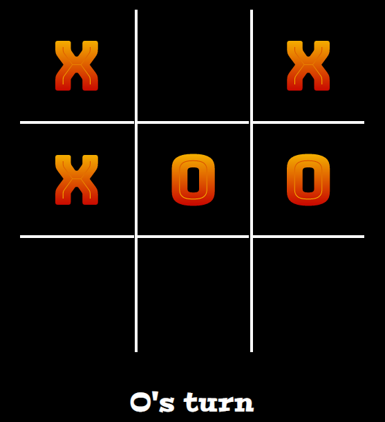
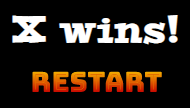

# Play Tic Tac Toe

This website allows two freinds to play a game of Tic Tac Toe against each other.
The game starts with player X always having the first turn.

Users must decide themselves who will be player X and who is PLayer O.
When player X is reeady, the game is started by clicking on a cell in the grid.

## Features 

This website is designed using HTML, CSS and JavaScript and allows two players to compete against each other in a game of Tic Tac Toe.

### Existing Features

- __HEADER__

  - The header is designed using the Google Font 'Bungee Spice' with a transparent background to allow the HTML black background be visible.
  - This font gives the impression of a retro style game and the contrast between the font's bright colours and black background make the heading stand out.

- __The Game Area__

  - This area allows the users to play the game. Users must decide who is player X and who is player O before starting as the default starting player is always player X. 
  - A message is shown below the main game board that show's who's turn it is next.
  - When a player wins, the message displays a message showing which player has won. In the event of a tie, the message displays the text 'Draw'.

    

- __Restart Game__

  - There is a button below the message area that allows users to restart the game on completion.
  - The button is styled using the same theme as the header and there is a hover effect that changes the cursor to a pointer.
  - The transform method is used to give the effect that the button jumps slightly when hovered over.

    

- __Future Features to Implement__

- A score area to keep track of each player's number of games won.
- More games

- __The Footer__ 

  - The footer section includes links to the relevant social media sites for. The links will open to a new tab to allow easy navigation for the user. 
  - The styling follows a similar theme to the header but in reverse. I used the color picker in MS paint and took the colors from the 'Bungee Spice' font and madde a background that transitions between those two colors.

## Testing 

The site was tested using the Chrome in-built developer features on a desktop and also tested on a 17 inch laptop and a Samsung Galaxy Tab A7 and iPhone 8 plus. Tested the website on multiple browsers also, including Chrome, Edge, Firfox, Brave.

The website looks the same on all browsers used for testing but starts to break down when screen width goes below 570px. Added media query in style.css for width below 570px.

### Validator Testing 

- HTML
  -  One error was returned for each of the nine cells when passing through the official [W3C validator](https://validator.w3.org/nu/?doc=https%3A%2F%2Fci-tom.github.io%2FPortfolio_Project2%2F)
- CSS
  - No errors were found when passing through the official [(Jigsaw) validator](http://jigsaw.w3.org/css-validator/validator?lang=en&profile=css3svg&uri=https%3A%2F%2Fci-tom.github.io%2FPortfolio_Project2%2F&usermedium=all&vextwarning=&warning=1)

### Unfixed Bugs

Could not fix the errors returned by W3C HTML validator website. When changing or removing the 'cellIndex' attribute, the game stops working.

## Deployment

- The site was deployed to GitHub pages. The steps to deploy are as follows: 
  - In the GitHub repository, navigate to the Settings tab 
  - Once on the settings page, navigate to pages icon on left column
  - Select 'Deploy from a branch' in source drop-down menu
  - Next, in Branch section, select main from drop-down menu and then click save.
  - Wait a couple of minutes and refresh the browser to see the link for the live site 

The live link can be found here - https://ci-tom.github.io/Portfolio_Project2/ 

## Credits 

The idea to create a Tic Tac Toe game came from multiple YouTube videos.

### Content 

- The basic design was taken from the YouTube channel [JavaScript Academy](https://youtu.be/B3pmT7Cpi24) and adapted for this project
- The icons in the footer were taken from [Font Awesome](https://fontawesome.com/)
- The fucntion for updating a cell when clicked was taken from YouTube channel [Bro Code](https://youtu.be/AnmwHjpEhtA).

### Media

- All media except for the Font Awsome icons is my own.
